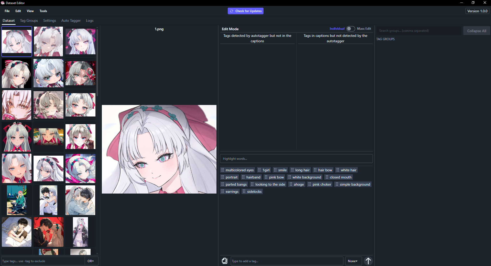
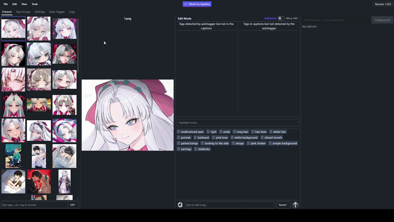
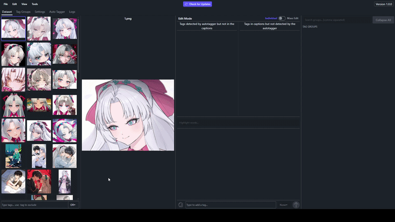
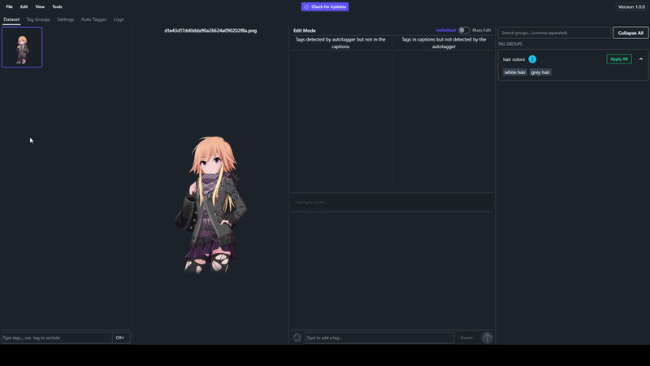

# Dataset Editor

> Load a folder full of images, tweak or auto-generate their tags, then save everything back, complete with undo/redo, tag-group presets, and a built-in Python autotagger.



## Download & Installation

Head to the **[Releases](https://github.com/Jelosus2/DatasetEditor/releases)** page and download the build that fits your platform:

- **Windows `.exe`**: Installer build.
- **Windows `.zip`**: Portable build.
- **Linux `.AppImage`**: Portable Linux build.
- **Linux `.deb`**: Debian/Ubuntu-based package.
- **Linux `.rpm`**: Fedora/RHEL-based package.

For Windows, run the installer or extract the zip.  
For Linux, use the package format that best matches your distribution, or use the AppImage if you want a portable build.

## Building & Packaging

### Requirements

You will need:

- **Node.js 22 or newer**
- **pnpm 10 or newer**
- For **Windows packaging**: a prepared `embedded_python` directory in the repository root

If you are preparing the embedded Python bundle yourself:

- add `pip` with [get-pip.py](https://bootstrap.pypa.io/get-pip.py)
- uncomment the `import site` line in the `.pth` file

If you want to test the autotagger in development on Windows, also copy the `embedded_python` directory into `tagger/embedded_python`.

### Install dependencies

```bash
pnpm install
```

### Run in development

Use two terminals:

```bash
# Terminal 1: start the Vite dev server
pnpm dev

# Terminal 2: launch Electron
pnpm electron
```

### Build the app

```bash
pnpm build
pnpm build:electron
```

### Package for Windows

```bash
pnpm package:win
```

### Package for Linux

On Debian/Ubuntu-based systems, install `rpm` first:

```bash
sudo apt-get update
sudo apt-get install -y rpm
```

Then package the app:

```bash
pnpm package:linux
```

## Features

- Visual dataset browser
- Autocomplete tag editor
- Built-in autotagger with model management
- Bulk tag operations with undo/redo
- Tag-group presets with JSON import/export
- Duplicate image finder
- Rename files tool
- Bucket crop tool and background color tool
- Danbooru wiki search
- Dark and light themes
- Auto-updates for packaged releases

## Feature Spotlights

### Visual Dataset Browser


Browse hundreds of images smoothly thanks to virtual scrolling.

### Smart Tag Autocomplete


Fast tag autocompletion powered by SQLite.

### Bulk Tag Ops + Undo/Redo


Messed up the tags of your dataset? You can fix them with bulk tag operations and undo/redo actions.

### Built-in Python Autotagger


Autotag your images in a few clicks. Dependency installation and model downloading are handled from inside the app.

### Tag Groups


Create reusable tag groups for hair styles, eye colors, characters, and more. Export them as JSON to share them with other people.

### Background Color For Transparent Images


Add a background color to transparent images without leaving the app.

### Browse Danbooru Wiki


Need to know what a tag represents? Search the Danbooru wiki directly from the app. And now you can even select the rating to display the example posts!

### Seamless Updates

The update service checks GitHub for new releases when the setting is enabled and notifies you from inside the app when an update is available.

## Contributing

PRs are welcome. Please make sure your changes meet the project's standards and keep your commits tidy.

## License

MIT License

Copyright (c) 2025 Jelosus1

Permission is hereby granted, free of charge, to any person obtaining a copy
of this software and associated documentation files (the "Software"), to deal
in the Software without restriction, including without limitation the rights
to use, copy, modify, merge, publish, distribute, sublicense, and/or sell
copies of the Software, and to permit persons to whom the Software is
furnished to do so, subject to the following conditions:

The above copyright notice and this permission notice shall be included in all
copies or substantial portions of the Software.

THE SOFTWARE IS PROVIDED "AS IS", WITHOUT WARRANTY OF ANY KIND, EXPRESS OR
IMPLIED, INCLUDING BUT NOT LIMITED TO THE WARRANTIES OF MERCHANTABILITY,
FITNESS FOR A PARTICULAR PURPOSE AND NONINFRINGEMENT. IN NO EVENT SHALL THE
AUTHORS OR COPYRIGHT HOLDERS BE LIABLE FOR ANY CLAIM, DAMAGES OR OTHER
LIABILITY, WHETHER IN AN ACTION OF CONTRACT, TORT OR OTHERWISE, ARISING FROM,
OUT OF OR IN CONNECTION WITH THE SOFTWARE OR THE USE OR OTHER DEALINGS IN THE
SOFTWARE.

## Credits

- **FallenIncursio** - Sponsor
- **Kojimbo** - Tested the program and gave feedback.
- **Squibeel** - Tested the program and gave feedback.
- **Starrypon** - Tested the program and gave feedback.
- **Anzhc** - Gave feedback.
