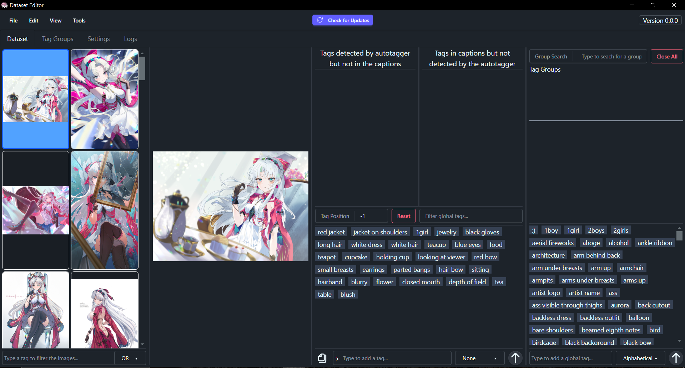

# Dataset Editor

> Load a folder full of images, tweak or auto-generate their tags, then save everything back—complete with undo/redo, tag-group presets, and a built-in Python autotagger.



## 🚀 Download & Installation

1. Head to the **[Releases](https://github.com/Jelosus2/DatasetEditor/releases)** page and grab the installer or the zip.
2. Run the installer or extract the zip.

## 🛠 Building & Packaging

You’ll need:
- **Node.js ≥ 20** (download it [here](https://nodejs.org/en/download)) and **pnpm** (or npm).
- Embedded version of a compatible python version inside the root directory named `embedded_python`
- (Optional) Add a csv file for autocompletions named `danbooru.csv` in `Data/TagAutocompletions` and load the csv into the database.

```bash
# Install dependencies
pnpm install

# Start the app in dev mode
pnpm e-dev

# Create a production package
pnpm package:win
```

## ✨ Features

- Visual dataset browser  
- Autocomplete tag editor  
- Bult-in autotagger 
- Bulk tag operations + undo/redo  
- Tag-group presets with import/export to JSON file 
- Add background color to PNG images
- Search in Danboorus wiki
- Dark/light themes
- Auto-updates (Installer Only)

## 📸 Feature Spotlights

### Visual Dataset Browser
 

Browse hundreds of images smoothly thanks to virtual scrolling.

### Smart Tag Autocomplete


Blazing fast autocompletions thanks to the power of SQLite.

### Bulk Tag Ops + Undo/Redo


You messed up the tags of your dataset? Fear not, you can easily fix them using bulk tag operations and with the help of undo/redo actions

### Built-in Python Autotagger


Easily autotag your images in a few click, dependency installation and model downloading is fully automated.

### Tag Groups


Create reusable tag groups for hair styles, eye colors, characters... Everything you need. Export them as JSON to share them with other persons.

### Background Color For Transparent Images


Tired of having to use an external tool or website to add a background color to your transparent images? No you can do it within the app!

### Browse Danbooru Wiki


Ever wondered what a tag represents? You can now know within the comodity of being in the app.

### Seamless Updates (Installer Only)
The update service checks GitHub for new releases every launch (if the setting is enabled) and notifies you in the navbar. Just click download and install it when you’re ready.

## 🤝 Contributing

PRs are welcome! Please be sure it meets the standards of the code, and keep your commits tidy.

## 📄 License

MIT License

Copyright (c) 2025 Jelosus1

Permission is hereby granted, free of charge, to any person obtaining a copy
of this software and associated documentation files (the "Software"), to deal
in the Software without restriction, including without limitation the rights
to use, copy, modify, merge, publish, distribute, sublicense, and/or sell
copies of the Software, and to permit persons to whom the Software is
furnished to do so, subject to the following conditions:

The above copyright notice and this permission notice shall be included in all
copies or substantial portions of the Software.

THE SOFTWARE IS PROVIDED "AS IS", WITHOUT WARRANTY OF ANY KIND, EXPRESS OR
IMPLIED, INCLUDING BUT NOT LIMITED TO THE WARRANTIES OF MERCHANTABILITY,
FITNESS FOR A PARTICULAR PURPOSE AND NONINFRINGEMENT. IN NO EVENT SHALL THE
AUTHORS OR COPYRIGHT HOLDERS BE LIABLE FOR ANY CLAIM, DAMAGES OR OTHER
LIABILITY, WHETHER IN AN ACTION OF CONTRACT, TORT OR OTHERWISE, ARISING FROM,
OUT OF OR IN CONNECTION WITH THE SOFTWARE OR THE USE OR OTHER DEALINGS IN THE
SOFTWARE.

## 🙏 Credits
* **FallenIncursio** - Sponsor
* **Kojimbo** - Tested the program and gave feedback.
* **Squibeel** - Tested the program and gave feedback.
* **Starrypon** - Tested the program and gave feedback.
* **Anzhc** - Gave feedback.